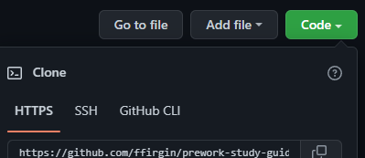

# Portfolio:

## GitHub pages link: https://ffirgin.github.io/My-Portfolio/#contact

## Description

This project is my personal portfolio to host all of my different works that I have worked and are currently working on. To allow myself to be seen more, this portfolio provides a central location for users and companies alike to view what I've created.

## Installation

1. On the repository, click Code, and copy the HTTPS link.
   
2. Open your Git Bash terminal.
3. Navigate to where you store your repositories locally on your system
   Ex. ~/Documents/GitHub/, etc
4. Type `git clone ` and paste the HTTPS link from the repository page at the end of the line.
5. Hit Enter and allow the repository to be downloaded.
6. Success! You've downloaded the repository! ♪⁽⁽٩( ᐖ )۶⁾⁾ ₍₍٩( ᐛ )۶₎₎♪

What are the steps required to install your project? Provide a step-by-step description of how to get the development environment running.

## Usage

For you, the viewer, to see the projects I've created in a neat and orderly fashion.

## License

MIT License

Copyright (c) [2022] [Griffin Hobbs]

Permission is hereby granted, free of charge, to any person obtaining a copy
of this software and associated documentation files (the "Software"), to deal
in the Software without restriction, including without limitation the rights
to use, copy, modify, merge, publish, distribute, sublicense, and/or sell
copies of the Software, and to permit persons to whom the Software is
furnished to do so, subject to the following conditions:

The above copyright notice and this permission notice shall be included in all
copies or substantial portions of the Software.

THE SOFTWARE IS PROVIDED "AS IS", WITHOUT WARRANTY OF ANY KIND, EXPRESS OR
IMPLIED, INCLUDING BUT NOT LIMITED TO THE WARRANTIES OF MERCHANTABILITY,
FITNESS FOR A PARTICULAR PURPOSE AND NONINFRINGEMENT. IN NO EVENT SHALL THE
AUTHORS OR COPYRIGHT HOLDERS BE LIABLE FOR ANY CLAIM, DAMAGES OR OTHER
LIABILITY, WHETHER IN AN ACTION OF CONTRACT, TORT OR OTHERWISE, ARISING FROM,
OUT OF OR IN CONNECTION WITH THE SOFTWARE OR THE USE OR OTHER DEALINGS IN THE
SOFTWARE.
